```mermaid
flowchart TD
    %% Start Node
    START([🚀 Test Execution Begins])

    %% Configuration Phase
    CONFIG[⚙️ Configuration Setup]
    CONFIG --> ENV_CHECK{Environment<br/>Configured?}
    ENV_CHECK -->|Yes| API_READY[✅ AI Providers Ready]
    ENV_CHECK -->|No| CONFIG_ERROR[❌ Configuration Error<br/>Missing API Keys]

    %% Test Execution Phase
    API_READY --> TEST_EXEC[🎭 Playwright Test Execution]
    TEST_EXEC --> TEST_RESULTS[Test Results<br/>Generated]

    %% Analysis Phase
    TEST_RESULTS --> FAILURE_CHECK{Tests<br/>Passed?}

    FAILURE_CHECK -->|✅ All Passed| SUCCESS_REPORT[📊 Success Report<br/>Generated]
    FAILURE_CHECK -->|❌ Some Failed| FAILURE_ANALYSIS[🔍 AI Failure Analysis]

    %% AI Analysis Flow
    FAILURE_ANALYSIS --> PROVIDER_SELECT{AI Provider<br/>Available?}
    PROVIDER_SELECT -->|OpenAI| OPENAI_ANALYZE[🤖 OpenAI Analysis]
    PROVIDER_SELECT -->|TogetherAI| TOGETHER_ANALYZE[🧠 TogetherAI Analysis]
    PROVIDER_SELECT -->|None| FALLBACK_ANALYZE[📋 Rule-based<br/>Fallback Analysis]

    %% Analysis Results
    OPENAI_ANALYZE --> ANALYSIS_COMPLETE
    TOGETHER_ANALYZE --> ANALYSIS_COMPLETE
    FALLBACK_ANALYZE --> ANALYSIS_COMPLETE

    ANALYSIS_COMPLETE[📝 Analysis Complete] --> CLUSTERING

    %% Clustering Phase
    CLUSTERING[🔗 Failure Clustering<br/>Pattern Recognition] --> CLUSTER_RESULTS

    %% Report Generation
    CLUSTER_RESULTS[📈 Clustered Results] --> REPORT_GEN[📄 HTML Report<br/>Generation]

    REPORT_GEN --> REPORT_READY[🎯 AI Analysis Report<br/>Ready]

    %% Notification Phase
    REPORT_READY --> NOTIFY_CHECK{Slack<br/>Configured?}
    NOTIFY_CHECK -->|Yes| SLACK_NOTIFY[📢 Slack Notification<br/>Sent]
    NOTIFY_CHECK -->|No| COMPLETE

    SLACK_NOTIFY --> COMPLETE
    SUCCESS_REPORT --> COMPLETE

    %% End Node
    COMPLETE([✅ Framework Execution Complete])

    %% Error Handling
    CONFIG_ERROR --> END_ERROR([❌ Setup Failed])
    TEST_EXEC --> TEST_ERROR[Test Execution<br/>Error]
    TEST_ERROR --> END_ERROR

    %% Styling
    classDef startClass fill:#e1f5fe,stroke:#01579b,stroke-width:2px
    classDef configClass fill:#f3e5f5,stroke:#4a148c,stroke-width:2px
    classDef testClass fill:#e8f5e8,stroke:#1b5e20,stroke-width:2px
    classDef aiClass fill:#fff3e0,stroke:#e65100,stroke-width:2px
    classDef reportClass fill:#fce4ec,stroke:#880e4f,stroke-width:2px
    classDef successClass fill:#e8f5e8,stroke:#2e7d32,stroke-width:2px
    classDef errorClass fill:#ffebee,stroke:#c62828,stroke-width:2px

    class START,COMPLETE startClass
    class CONFIG,ENV_CHECK,API_READY configClass
    class TEST_EXEC,TEST_RESULTS,FAILURE_CHECK testClass
    class FAILURE_ANALYSIS,PROVIDER_SELECT,OPENAI_ANALYZE,TOGETHER_ANALYZE,FALLBACK_ANALYZE,ANALYSIS_COMPLETE,CLUSTERING,CLUSTER_RESULTS aiClass
    class REPORT_GEN,REPORT_READY,NOTIFY_CHECK,SLACK_NOTIFY reportClass
    class SUCCESS_REPORT successClass
    class CONFIG_ERROR,TEST_ERROR,END_ERROR errorClass
```

# AI-TestcaseAnalyzer Business Flow

## 🎯 Overview
This diagram illustrates the high-level business flow of the AI-TestcaseAnalyzer framework, showing how automated testing integrates with AI-powered failure analysis to provide intelligent insights and actionable solutions.

## 🔄 Flow Explanation

### 1. **Configuration Phase** (Purple)
- Framework validates environment setup
- Checks API key configuration for AI providers
- Ensures all prerequisites are met before execution

### 2. **Test Execution Phase** (Green)
- Playwright executes automated tests
- Collects test results and failure data
- Self-healing mechanisms attempt to recover from common issues

### 3. **AI Analysis Phase** (Orange)
- Failed tests are analyzed by AI providers (OpenAI/TogetherAI)
- Intelligent failure clustering identifies patterns
- Fallback to rule-based analysis if AI unavailable

### 4. **Reporting Phase** (Pink)
- Comprehensive HTML reports generated with AI insights
- Interactive visualizations and trend analysis
- Optional Slack notifications for team communication

### 5. **Completion** (Blue)
- Framework execution complete
- All artifacts saved and notifications sent

## 🛡️ Error Handling
- Configuration errors caught early
- Test execution failures handled gracefully
- AI provider failures trigger fallback mechanisms
- Comprehensive error logging throughout

## 🎨 Key Features Highlighted
- **Multi-Provider AI Support**: OpenAI and TogetherAI integration
- **Intelligent Fallbacks**: Rule-based analysis when AI unavailable
- **Self-Healing Tests**: Adaptive element selection
- **Comprehensive Reporting**: HTML reports with charts and insights
- **Team Integration**: Slack notifications for CI/CD pipelines

---
*Generated for AI-TestcaseAnalyzer v1.0.0*