# Mermaid Flowchart Code for AI-TestcaseAnalyzer

## 📊 Available Flowcharts

### 1. **Detailed Business Flow** (`flowchart-detailed.mmd`)
- Complete framework workflow with error handling
- Color-coded phases and decision points
- Includes all AI providers and fallback mechanisms

### 2. **Simple Overview Flow** (`flowchart-simple.mmd`)
- High-level 6-step process
- Perfect for README embedding
- Quick understanding of main workflow

## 🚀 How to Use

### **Method 1: GitHub/GitLab README**
Simply copy and paste the Mermaid code between triple backticks:

```markdown

```mermaid
flowchart TD
    START([🚀 Start]) --> CONFIG[⚙️ Configure AI Providers]
    CONFIG --> TEST_EXEC[🎭 Run Playwright Tests]
    ...
```

```

### **Method 2: Online Mermaid Editor**
1. Go to [Mermaid Live Editor](https://mermaid.live/)
2. Copy the code from `.mmd` files
3. Paste and see live preview
4. Export as PNG/SVG

### **Method 3: VS Code Extension**
1. Install "Mermaid Preview" extension
2. Open `.mmd` files
3. Preview diagrams directly in VS Code

### **Method 4: Documentation Sites**
- **GitBook**: Native Mermaid support
- **Docusaurus**: Use mermaid plugin
- **MkDocs**: Use mermaid2 plugin

### **Method 5: Confluence/Jira**
1. Install Mermaid macro/plugin
2. Paste the code in code blocks
3. Diagrams render automatically

## 🎨 Customization

### **Colors & Styling**
The detailed flowchart uses CSS classes for styling:
- `startClass`: Blue (start/end nodes)
- `configClass`: Purple (configuration)
- `testClass`: Green (test execution)
- `aiClass`: Orange (AI analysis)
- `reportClass`: Pink (reporting)
- `successClass`: Green (success paths)
- `errorClass`: Red (error handling)

### **Modifying the Flow**
- Add new nodes: `NEW_NODE[Label]`
- Add connections: `NODE1 --> NODE2`
- Add decisions: `NODE{Question?}`
- Add styling: `class NODE1,NODE2 className`

## 📋 Quick Copy Templates

### **Basic Flow Structure**


### **With Styling**


## 🔧 Tools & Resources

- **Mermaid Documentation**: [mermaid.js.org](https://mermaid.js.org/)
- **Live Editor**: [mermaid.live](https://mermaid.live/)
- **VS Code Extension**: Search "Mermaid Preview"
- **Color Picker**: Use for custom styling

## 📝 Notes

- All diagrams use Top-Down (TD) flow direction
- Emojis enhance visual understanding
- Color coding helps identify process phases
- Error handling paths are clearly marked