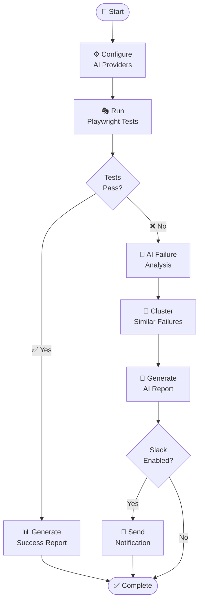

# 🤖 AI-TestcaseAnalyzer

[](https://playwright.dev/)
[](https://www.typescriptlang.org/)
[](https://openai.com/)
[](https://nodejs.org/)

> **AI-Powered Test Automation Framework** - Transform your test failures into actionable insights with intelligent AI analysis, automated clustering, and comprehensive reporting.

---

## 🎯 What is AI-TestcaseAnalyzer?

AI-TestcaseAnalyzer is a cutting-edge test automation framework that combines the power of **Playwright** for reliable end-to-end testing with **AI-driven failure analysis** to provide intelligent insights into test failures. Instead of spending hours debugging cryptic error messages, get **actionable solutions** and **prevention strategies** automatically generated by AI.

### ✨ Key Benefits

- 🔍 **Intelligent Failure Analysis**: AI automatically analyzes test failures and provides root cause analysis
- 📊 **Smart Failure Clustering**: Groups similar failures to identify patterns and systemic issues
- 🎯 **Actionable Solutions**: Get specific recommendations on how to fix and prevent failures
- 📈 **Historical Trends**: Track test reliability and improvement over time
- 🔧 **Self-Healing Tests**: Adaptive element selection improves test stability
- 📱 **Beautiful Reports**: Interactive HTML reports with charts and visualizations
- 🚀 **Production Ready**: Designed for CI/CD integration with Slack notifications

---

## 🚀 Quick Start (5 Minutes)

### Prerequisites

- **Node.js 16+** ([Download here](https://nodejs.org/))
- **npm** (comes with Node.js)
- **Git** ([Download here](https://git-scm.com/))

### Step 1: Clone & Install

```bash
# Clone the repository
git clone https://github.com/RajniNepaliVeltris/AI-TestcaseAnalyzer.git
cd AI-TestcaseAnalyzer

# Install dependencies
npm install

# Install Playwright browsers
npm run playwright:install
```

### Step 2: Configure AI Providers

Create a `.env.prod` file in the project root:

```bash
# Create environment file
touch .env.prod
```

Add your AI provider API keys:

```env
# Required: At least one AI provider
OPENAI_API_KEY=sk-your-openai-api-key-here
TOGETHER_API_KEY=your-together-api-key-here

# Optional: Slack notifications
SLACK_WEBHOOK_URL=https://hooks.slack.com/services/YOUR/SLACK/WEBHOOK
```

> 💡 **Tip**: Get API keys from [OpenAI](https://platform.openai.com/api-keys) or [Together AI](https://api.together.xyz/)

### Step 3: Run Your First Test

```bash
# Run tests with AI analysis
npm run prod
```

That's it! 🎉 Your tests will run and you'll get an AI-powered analysis report.

---

## 📋 Detailed Installation Guide

### System Requirements

| Component | Version | Purpose |
|-----------|---------|---------|
| Node.js | 16.0+ | Runtime environment |
| npm | 7.0+ | Package manager |
| TypeScript | 5.4+ | Type checking |
| Playwright | 1.44+ | Test automation |

### Installation Steps

1. **Clone Repository**
   ```bash
   git clone https://github.com/RajniNepaliVeltris/AI-TestcaseAnalyzer.git
   cd AI-TestcaseAnalyzer
   ```

2. **Install Dependencies**
   ```bash
   npm install
   ```

3. **Install Playwright Browsers**
   ```bash
   npm run playwright:install
   ```

4. **Verify Installation**
   ```bash
   npm run build
   ```

### Configuration Files

#### `.env.prod` - Production Environment
```env
# AI Provider Configuration
OPENAI_API_KEY=sk-your-openai-key
TOGETHER_API_KEY=your-together-key

# Optional: Slack Integration
SLACK_WEBHOOK_URL=https://hooks.slack.com/services/YOUR/WEBHOOK
```

#### `qa-analyzer.config.json` - Framework Settings
```json
{
  "resultsPath": "artifacts/results.json",
  "outputHtml": "artifacts/html-report/ai-failure-report.html",
  "aiProviders": ["OpenAI", "TogetherAI"],
  "fallback": "Rule-based",
  "reportSettings": {
    "includeCharts": true,
    "includeHistory": true
  }
}
```

---

## 🎮 Usage Guide

### Basic Commands

```bash
# Run tests only (no AI analysis)
npm run test

# Run tests with AI analysis (production mode)
npm run prod

# Generate AI analysis report only
npm run prod:report

# Run unit tests
npm run test:unit
```

### Advanced Usage

#### Run Specific Tests
```bash
# Run tests with specific tags
npm run test -- --grep "@smoke"

# Run in headed mode (visible browser)
npm run test -- --headed

# Run with more workers for faster execution
npm run test -- --workers 4
```

#### CI/CD Integration
```bash
# Full production pipeline
npm run prod

# With Slack notifications
npm run ci
```

### Understanding the Output

After running tests, you'll find:

```
artifacts/
├── results.json              # Raw test results
├── playwright-results.json   # Playwright test data
└── html-report/
    ├── index.html           # Playwright HTML report
    └── ai-analysis-report.html  # AI Analysis Report
```

---

## 🔄 How It Works (Business Flow)



### Flow Explanation:
1. **Configure** → Set up AI providers (OpenAI/TogetherAI)
2. **Execute** → Run Playwright automated tests
3. **Analyze** → AI analyzes failures (or falls back to rules)
4. **Cluster** → Group similar failures for pattern recognition
5. **Report** → Generate comprehensive HTML reports
6. **Notify** → Optional Slack notifications

---

## 🧠 AI Analysis Features

### What the AI Analyzes

The framework automatically detects and analyzes:

- **🔐 Authentication Failures**: Login issues, credential problems
- **⏱️ Timing Issues**: Race conditions, slow loading elements
- **👁️ Visibility Problems**: Hidden elements, DOM issues
- **🌐 Network Errors**: API failures, connectivity issues
- **📝 Form Validation**: Input validation failures
- **🔄 State Management**: Application state issues
- **🎭 Shadow DOM**: Complex DOM structure problems

### AI Analysis Report

The AI generates a comprehensive report including:

- **Root Cause Analysis**: Why the test failed
- **Suggested Fixes**: Step-by-step solutions
- **Prevention Strategies**: How to avoid similar issues
- **Confidence Scores**: How reliable the analysis is
- **Failure Clustering**: Groups similar failures
- **Historical Trends**: Test reliability over time

### Fallback System

If AI providers are unavailable, the framework gracefully falls back to:
1. **Rule-based analysis** (pattern matching)
2. **Manual investigation** guidance

---

## 📊 Available Scripts

| Command | Description | Use Case |
|---------|-------------|----------|
| `npm run prod` | Full production run with AI analysis | Main production command |
| `npm run test` | Run Playwright tests only | Quick testing |
| `npm run prod:report` | Generate AI analysis report | Report generation only |
| `npm run build` | Build TypeScript | Development |
| `npm run test:unit` | Run unit tests | Testing framework code |
| `npm run analyze` | AI analysis only | Standalone analysis |
| `npm run cluster` | Failure clustering | Pattern analysis |
| `npm run setup` | Environment setup | Initial configuration |
| `npm run ci` | CI/CD pipeline | Automated testing |

---

## 🏗️ Project Structure

```
AI-TestcaseAnalyzer/
├── src/                          # Source code
│   ├── ai-failure-analyzer.ts    # Core AI analysis logic
│   ├── failure-clustering.ts     # Failure pattern clustering
│   ├── report-generator.ts       # HTML report generation
│   ├── selfHealing.ts           # Self-healing mechanisms
│   ├── run-all.ts               # Main test orchestration
│   ├── services/                # Core services
│   │   ├── ai/                  # AI provider integrations
│   │   └── reporting/           # Report generation
│   ├── types/                   # TypeScript definitions
│   └── utils/                   # Utility functions
├── tests/                       # Test specifications
│   └── ai-analysis-demo.spec.ts # Demo test suite
├── artifacts/                   # Generated reports & data
├── qa-analyzer.config.json      # Framework configuration
├── playwright.config.ts         # Playwright configuration
├── tsconfig.json               # TypeScript configuration
└── package.json                # Dependencies & scripts
```

---

## � Configuration Options

### AI Providers

Configure which AI services to use in `qa-analyzer.config.json`:

```json
{
  "aiProviders": ["OpenAI", "TogetherAI"]
}
```

### Report Settings

Customize report generation:

```json
{
  "reportSettings": {
    "includeCharts": true,      # Include visual charts
    "includeHistory": true      # Include historical trends
  }
}
```

### Playwright Configuration

Modify `playwright.config.ts` for test behavior:

```typescript
export default defineConfig({
  timeout: 30000,        // Test timeout
  retries: 1,           // Retry failed tests
  workers: 1,           // Parallel workers
  headless: true        // Headless mode
});
```

---

## 🚨 Troubleshooting

### Common Issues

#### ❌ "AI analysis failed"
**Solution**: Check your API keys in `.env.prod`
```bash
# Verify keys are set
echo $OPENAI_API_KEY
echo $TOGETHER_API_KEY
```

#### ❌ "Playwright browsers not found"
**Solution**: Install Playwright browsers
```bash
npm run playwright:install
```

#### ❌ "Build failed"
**Solution**: Check TypeScript errors
```bash
npm run build
```

#### ❌ "Tests timeout"
**Solution**: Increase timeout in `playwright.config.ts`
```typescript
timeout: 60000  // 60 seconds
```

### Debug Mode

Enable verbose logging:
```bash
DEBUG=ai-testcase-analyzer npm run prod
```

### Getting Help

1. Check the logs in `artifacts/report-error.log`
2. Verify your Node.js version: `node --version`
3. Test API keys manually with a simple curl request

---

## 🔄 CI/CD Integration

### GitHub Actions Example

```yaml
name: AI Test Analysis
on: [push, pull_request]

jobs:
  test:
    runs-on: ubuntu-latest
    steps:
      - uses: actions/checkout@v3
      - uses: actions/setup-node@v3
        with:
          node-version: '18'
      - run: npm install
      - run: npm run playwright:install
      - run: npm run prod
      - uses: actions/upload-artifact@v3
        with:
          name: test-results
          path: artifacts/
```

### Jenkins Pipeline

```groovy
pipeline {
    agent any
    stages {
        stage('Test') {
            steps {
                sh 'npm install'
                sh 'npm run playwright:install'
                sh 'npm run prod'
            }
            post {
                always {
                    publishHTML([
                        allowMissing: false,
                        alwaysLinkToLastBuild: true,
                        keepAll: true,
                        reportDir: 'artifacts/html-report',
                        reportFiles: 'ai-analysis-report.html',
                        reportName: 'AI Test Analysis'
                    ])
                }
            }
        }
    }
}
```

---

## 🤝 Contributing

We welcome contributions! Here's how to get started:

### Development Setup

1. **Fork & Clone**
   ```bash
   git clone https://github.com/YOUR-USERNAME/AI-TestcaseAnalyzer.git
   cd AI-TestcaseAnalyzer
   ```

2. **Install Dependencies**
   ```bash
   npm install
   ```

3. **Run Tests**
   ```bash
   npm run test:unit
   npm run test
   ```

4. **Make Changes**
   - Follow TypeScript best practices
   - Add tests for new features
   - Update documentation

5. **Submit PR**
   ```bash
   git checkout -b feature/amazing-feature
   git commit -m 'Add amazing feature'
   git push origin feature/amazing-feature
   ```

### Code Standards

- **TypeScript**: Strict mode enabled
- **Testing**: Unit tests required for new features
- **Documentation**: Update README for API changes
- **Commits**: Use conventional commit format

---

## 📈 Performance & Reliability

### Circuit Breaker Pattern
- Automatically handles AI provider failures
- Falls back gracefully to rule-based analysis
- Prevents cascade failures

### Rate Limiting
- Respects API provider limits
- Implements exponential backoff
- Caches frequent requests

### Self-Healing Tests
- Adaptive element selection
- Multiple selector strategies
- Automatic retry with different approaches

---

## � License

This project is licensed under the **MIT License** - see the [LICENSE](LICENSE) file for details.

---

## 🙏 Acknowledgments

- **Playwright** - Reliable test automation
- **OpenAI** - Powerful AI analysis
- **Together AI** - Cost-effective AI solutions
- **Chart.js** - Beautiful data visualizations

---

## 📞 Support

- 📧 **Email**: rajni.np@example.com
- 🐛 **Issues**: [GitHub Issues](https://github.com/RajniNepaliVeltris/AI-TestcaseAnalyzer/issues)
- 📖 **Documentation**: [Wiki](https://github.com/RajniNepaliVeltris/AI-TestcaseAnalyzer/wiki)

---

<div align="center">

**Made with ❤️ for the testing community**

⭐ Star this repo if you find it helpful!

[⬆️ Back to Top](#-ai-testcaseanalyzer)

</div>